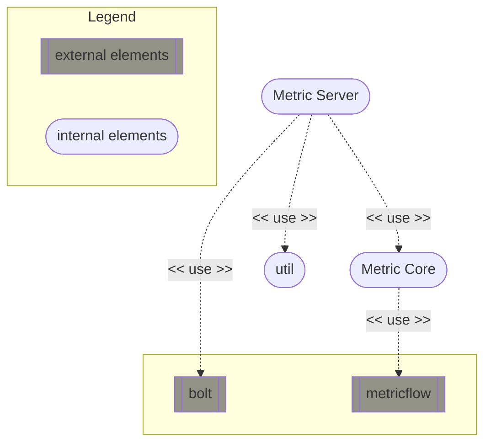

---
{"dg-publish":true,"permalink":"/data/dbt/__/metricstore-sda-toplevel-module-view/"}
---

> [!tldr] Top Level View in MetricStore

### Primary Presentation

### Element Catalog

#### Metric Server

슬랙 인터페이스는 이 모듈에서 구현된다. 사용자는 지표를 검색하고, 새로운 지표 검색 결과를 확인할 수 있다. 이 모듈은 슬래시 커맨드 입력을 받아 앱 메세지로 결과를 확인한다. 슬랙 앱에서발생하는 이벤트를 구독하기 위해 Bolt 프레임워크를 사용한다.

비즈니스 로직은 이 모듈에서 구현되며 다음과 같은 기능을 제공한다.
- 생성된 지표 목록과 (작업자가 작성한)지표 생성 조건을 슬랙 모달로 제공한다.
- 사용자 입력으로 생성된 지표 데이터를 슬랙 메세지로 제공한다.
- 사용자 요청에 따른 성공/실패 여부를 슬랙 메세지로 제공한다.

#### Metric Core

Metric Core 는 지표 저장소 시스템에서 지표를 정의하고 관리하는 영역이다. dbt 모델에 정의한 지표를 조회하는 metricflow 를 이용해 구현했다. 지표를 검색할 수 있는 클라이언트를 관리하며, 지표를 생성할 수 있도록 SQL 쿼리를 생성하는 메커니즘을 제공한다.

#### bolt
[Bolt](https://api.slack.com/start/apps#bolt) 는 슬랙 앱을 빠르게 생성할 수 있는 프레임워크이다.

#### Metricflow
[Metricflow](https://github.com/dbt-labs/metricflow) 는 지표 정의를 쉽게 관리할 수 있는 시멘틱 레이어이다. 지표 정의들을 가져와 읽기 쉽고 재사용 가능한 SQL 을 생성한다.

### Context Diagram

N/A

### Variability Guide

N/A

### Rationale

#### Bolt
Bolt 는 JavaScript, Python 또는 Java 로 Slack 앱을 개발하는 가장 빠른 방법이다. 일반적으로 슬랙에 사용되는 기능을 제공하며, 앱을 구축하는 데 도움이 되는 기능을 갖추고 있다. Slack 에서 공식으로 제공하는 프레임워크는 bolt 만 존재하고, 빠르고 편리하게 슬랙앱을 제공하고자 bolt 프레임워크를 선택했다.

제공하는 언어 중 Python 을 선택한 이유는 다음과 같다.
- Metricflow 는 파이썬 클라이언트를 제공한다. 개발 편의성이 증가한다.
- 팀 내 언어 숙련도가 높다.

#### Metricflow

Metricflow 는 다음과 같은 이유로 선정했다.
- 오픈소스이다. 필요에 따라 수정 혹은 기여할 수 있다.
- dbt 친화적이다. 작업자는 모델파일에 metric & semantic_models 설정값을 추가하면, 사용자는 지표를 검색할 수 있다.
- dbt 프로젝트에서 지표를 정의하고 명령을 사용하여 지표를 쿼리할 수 있다. [dbt-labs](https://github.com/dbt-labs) 에서 관리하는 오픈소스이며 활발히 개발 진행중이다. 상당히 큰 지원 커뮤니티를 보유하고 있다.
- 팀내 언어 숙련도가 가장 높은 Python 으로 작성되었다.
- 대안으로 dbt_metrics 라는 dbt 패키지가 존재한다. 단, 해당 패키지는 Metricflow 와 제공하는 기능이 중복되고, jinja 로 이루어져 있어 관리가 어렵다는 판단에 deprecated 될 [예정](https://docs.getdbt.com/blog/deprecating-dbt-metrics)이다.
    

### Related Views

N/A