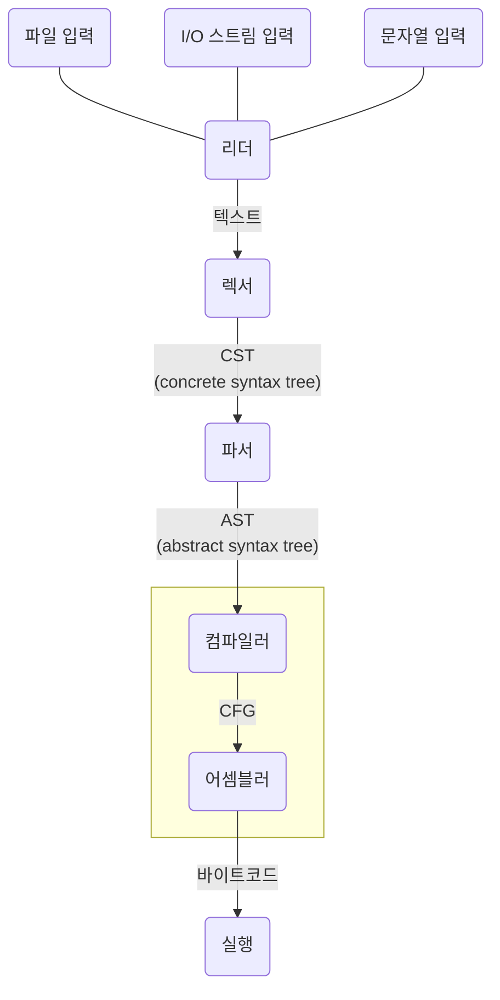
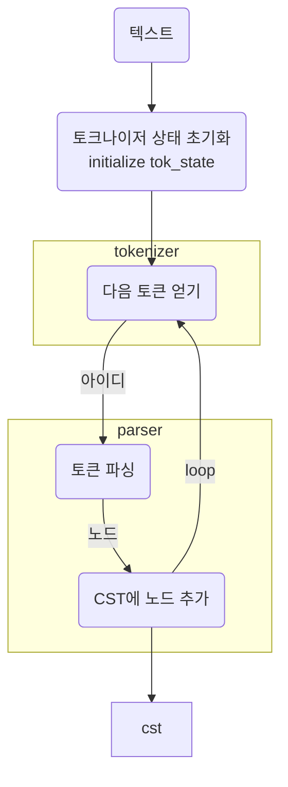
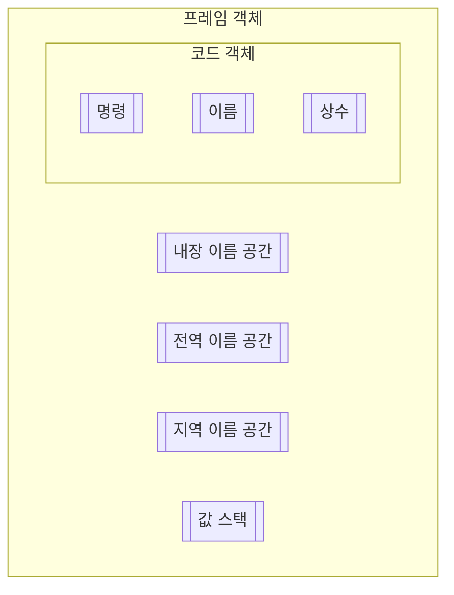

---
{"dg-publish":true,"permalink":"/etc/Python/CPython-파헤치기/"}
---


> [!info] CPython 파헤치기 책에서 나온 다이어그램을 직접 그려가며 머릿속으로 정리해본다. (~~뇌에 저장안되니까 노트에라도 저장해두자~~)

```table-of-contents
style: nestedList # TOC style (nestedList|inlineFirstLevel)
minLevel: 0 # Include headings from the specified level
maxLevel: 0 # Include headings up to the specified level
includeLinks: true # Make headings clickable
debugInConsole: false # Print debug info in Obsidian console
```

---

### Diagrams




- AST: 파이썬 문법과 문장들에 대한 **문맥 있는 트리 표현**
- CST: 토큰과 심벌에 대한 **문맥 없는 트리 표현**


#### 루프에서 파서와 토크나이저를 호출하는 과정





#### PyFrameObject





### 헷갈리는 단어 혹은 알아두면 좋을 내용


- 마샬링: 파일 내용을 메모리로 복사하여 특정 데이터 구조로 변환하는 것을 의미
    - more..
        - https://docs.python.org/ko/3/library/marshal.html
        - https://www.geeksforgeeks.org/marshal-internal-python-object-serialization/
- 평가루트 (execution loop)
    - execution loop 늠 코드 객체를 입력받아 frame 객체를 반환한다.
    - 인터프리터는 최소 한 개 스레드를 갖는다.
    - 각 스레드는 스레드 상태를 갖는다.
    - frame 객체는 프레임 스텍(stack frame)에서 실행된다.
        - https://google.github.io/pytype/developers/frames.html#overview
        - https://realpython.com/cpython-source-code-guide/#execution
    - 값 스택에서 변수를 참조할 수 있다.


### memory


- cpython 은 C의 동적 메모리 할당에 크게 의존한다. 가비지 컬렉션과 레퍼런스 카운팅 알고리즘을 이용한 안전장치가 존재한닼
- 

### reference
- [Defining Main Functions in Python](https://realpython.com/python-main-function/)
